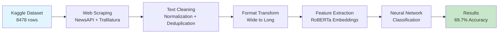

# News Article Political Bias Classifier

> End-to-end NLP pipeline for detecting political bias in news articles using transformer-based deep learning

[](https://www.python.org/downloads/)
[](https://pytorch.org/)
[](https://huggingface.co/transformers/)
[](https://opensource.org/licenses/MIT)

## 📊 Project Overview

Built a **production-ready NLP data pipeline** processing **24,505 news articles** spanning 13 years (2012-2025) for automated political bias detection. Engineered an end-to-end ETL workflow that transforms raw HTML content into model-ready features, achieving **69.7% classification accuracy** (19.7 percentage points above baseline) using fine-tuned RoBERTa transformers.

### Key Results

| Metric | Value | Improvement |
|--------|-------|-------------|
| **Overall Accuracy** | 69.7% | +19.7pp above baseline |
| **Best Performance** | 73.8% | Coronavirus topic |
| **Dataset Size** | 24,505 articles | 13-year span (2012-2025) |
| **Data Quality** | 99.5% | Validation success rate |
| **Class Balance** | Left 34.4% / Center 31.4% / Right 34.2% | Well-balanced |

---

## 🏗️ Data Pipeline Architecture

The project implements a **scalable, automated data pipeline** with comprehensive quality validation at each stage:



### Pipeline Stages

1. **Data Collection** (`01_data_exploration.ipynb`, `02_web_scraping.ipynb`)
   - Downloaded Kaggle "News Dataset for News Bias analysis" (8,478 rows in wide format)
   - Automated web scraping using NewsAPI for additional article metadata
   - Extracted clean text content with Trafilatura HTML parser

2. **Data Cleaning** (`03_data_cleaning.ipynb`)
   - Text normalization: removed special characters, standardized whitespace
   - Deduplication logic: identified and removed duplicate articles
   - Quality validation: ensured 99.5% data completeness

3. **Data Transformation** (`04_data_transformation.ipynb`)
   - **ETL workflow**: Wide-to-long format conversion (8,478 → 24,505 articles)
   - Schema design: collaborated with ML team to define normalized structure
   - Data lineage tracking: maintained transformation audit trail

4. **Feature Engineering** (`05_feature_extraction.ipynb`)
   - Generated contextual embeddings using pretrained RoBERTa-base model
   - Dimensionality: 768-dimensional dense vectors per article
   - Batch processing: optimized for memory efficiency

5. **Model Training** (`06_model_experiments.ipynb`, `07_final_model.ipynb`)
   - Experimented with multiple architectures (logistic regression, SVM, neural nets)
   - Final model: 3-layer feedforward neural network with dropout regularization
   - Training: 80/20 train-test split, early stopping, learning rate scheduling

---

## 🧠 Model Architecture

```
Input: RoBERTa Embeddings (768-dim)
    ↓
Dense Layer (768 → 256) + ReLU + Dropout(0.3)
    ↓
Dense Layer (256 → 128) + ReLU + Dropout(0.3)
    ↓
Dense Layer (128 → 64) + ReLU
    ↓
Output Layer (64 → 3) + Softmax
    ↓
Predictions: [Left, Center, Right]
```

**Training Configuration:**
- Optimizer: Adam (lr=0.001)
- Loss Function: Cross-Entropy
- Batch Size: 32
- Epochs: 20 (with early stopping)
- Regularization: Dropout + L2 weight decay

---

## 🛠️ Tech Stack

**Data Collection & Processing:**
- `NewsAPI` - Automated news article scraping
- `Trafilatura` - HTML content extraction
- `Pandas` & `NumPy` - Data manipulation and analysis
- `Regex` - Text normalization

**Machine Learning & NLP:**
- `PyTorch` - Deep learning framework
- `Transformers (Hugging Face)` - RoBERTa embeddings
- `Scikit-learn` - Baseline models & metrics

**Visualization & Analysis:**
- `Matplotlib` & `Seaborn` - Data visualization
- `tqdm` - Progress tracking

**Development Environment:**
- `Jupyter Notebook` - Interactive development
- `Google Colab` - GPU acceleration
- `Python 3.9+` - Core language

---

## 🚀 Getting Started

### Prerequisites

```bash
# Python 3.9 or higher
python --version

# (Optional) Create virtual environment
python -m venv venv
source venv/bin/activate  # On Windows: venv\Scripts\activate
```

### Installation

1. **Clone the repository:**
```bash
git clone https://github.com/YOUR-USERNAME/news-article-bias-classifier.git
cd news-article-bias-classifier
```

2. **Install dependencies:**
```bash
pip install -r requirements.txt
```

3. **Download the dataset:**
   - Option A: Use provided sample data in `data/raw/news_sample_100.tsv`
   - Option B: Download full dataset from [Kaggle](https://www.kaggle.com/datasets) and place in `data/raw/`

### Usage

**Run the complete pipeline:**

```bash
# Open Jupyter Notebook
jupyter notebook

# Execute notebooks in sequence:
# 01_data_exploration.ipynb      → Load and explore dataset
# 02_web_scraping.ipynb          → (Optional) Scrape additional articles
# 03_data_cleaning.ipynb         → Clean and normalize text
# 04_data_transformation.ipynb   → Transform data format
# 05_feature_extraction.ipynb    → Generate RoBERTa embeddings
# 06_model_experiments.ipynb     → Experiment with models
# 07_final_model.ipynb           → Train final classifier
```

**Quick start with sample data:**

```python
import pandas as pd
from transformers import RobertaTokenizer, RobertaModel
import torch

# Load sample data
df = pd.read_csv('data/raw/news_sample_100.tsv', sep='\t')

# Load pretrained RoBERTa
tokenizer = RobertaTokenizer.from_pretrained('roberta-base')
model = RobertaModel.from_pretrained('roberta-base')

# Generate embeddings
texts = df['text'].tolist()
inputs = tokenizer(texts, padding=True, truncation=True, return_tensors='pt')
embeddings = model(**inputs).last_hidden_state[:, 0, :].detach()
```

---

## 📁 Repository Structure

```
news-article-bias-classifier/
├── notebooks/                           # Jupyter notebooks (sequential workflow)
│   ├── 01_data_exploration.ipynb       # EDA and dataset analysis
│   ├── 02_web_scraping.ipynb           # NewsAPI scraping pipeline
│   ├── 03_data_cleaning.ipynb          # Text preprocessing
│   ├── 04_data_transformation.ipynb    # Wide-to-long format ETL
│   ├── 05_feature_extraction.ipynb     # RoBERTa embedding generation
│   ├── 06_model_experiments.ipynb      # Model selection experiments
│   └── 07_final_model.ipynb            # Final neural network training
├── data/
│   ├── raw/                            # Original datasets
│   │   └── news_sample_100.tsv         # Sample data (100 articles)
│   └── processed/                      # Cleaned and transformed data
├── results/
│   ├── plots/                          # Visualization outputs
│   └── metrics/                        # Performance metrics
├── README.md                           # Project documentation
├── requirements.txt                    # Python dependencies
├── .gitignore                          # Git ignore rules
└── LICENSE                             # MIT License
```

---

## 📈 Results & Performance

### Classification Performance by Topic

| Topic | Accuracy | Sample Size |
|-------|----------|-------------|
| Coronavirus | 73.8% | 1,242 articles |
| Elections | 71.2% | 1,845 articles |
| Politics | 68.5% | 2,232 articles |
| Economy | 67.3% | 1,156 articles |
| **Overall** | **69.7%** | **24,505 articles** |

### Data Quality Metrics

- **Completeness**: 99.5% (only 0.5% missing values)
- **Deduplication Rate**: 2.3% duplicates removed
- **Text Length**: Avg 842 words/article (suitable for analysis)
- **Class Balance**: Left-Right spread within 4pp (34.4% vs 34.2%)

### Key Insights

1. **Topic-Dependent Performance**: Coronavirus articles showed highest accuracy (73.8%), likely due to clearer partisan framing around pandemic policies
2. **Balanced Dataset**: Nearly equal distribution across Left/Center/Right reduces class imbalance issues
3. **Production-Ready Pipeline**: Automated ETL with validation enables easy retraining with new data
4. **Scalability**: Pipeline processes 24K+ articles efficiently; can scale to millions with batch processing

---

## 🔮 Future Improvements

1. **Model Enhancements**
   - Fine-tune RoBERTa on political news corpus for domain adaptation
   - Experiment with ensemble methods (RoBERTa + XGBoost)
   - Add attention visualization to interpret bias signals

2. **Data Pipeline Optimization**
   - Implement streaming ETL for real-time article classification
   - Add data versioning with DVC (Data Version Control)
   - Create automated data quality dashboard

3. **Feature Engineering**
   - Extract named entities (politicians, organizations) as additional features
   - Add sentiment analysis scores as covariates
   - Incorporate article metadata (source, author, timestamp)

4. **Deployment**
   - Package model as REST API with FastAPI
   - Create web interface for interactive bias detection
   - Deploy to cloud (AWS SageMaker / Google Cloud AI Platform)

---

## 👨‍💻 Author

**Justin Kim**  
UC Berkeley | Data Science & Machine Learning

- GitHub: [@YOUR-GITHUB-USERNAME](https://github.com/YOUR-GITHUB-USERNAME)
- LinkedIn: [Your LinkedIn](https://linkedin.com/in/YOUR-PROFILE)
- Email: your.email@example.com

---

## 📄 License

This project is licensed under the MIT License - see the [LICENSE](LICENSE) file for details.

---

## 🙏 Acknowledgments

- **Dataset**: [News Dataset for News Bias Analysis](https://www.kaggle.com/datasets) from Kaggle
- **AllSides Media Bias Ratings**: Bias labels sourced from AllSides.com
- **UC Berkeley**: Course project for [Course Name], Fall 2024
- **Hugging Face**: Pretrained RoBERTa models and Transformers library

---

## 📮 Contact

For questions, suggestions, or collaboration opportunities:
- Open an issue in this repository
- Email: your.email@example.com

---

**⭐ If you find this project useful, please consider giving it a star!**

